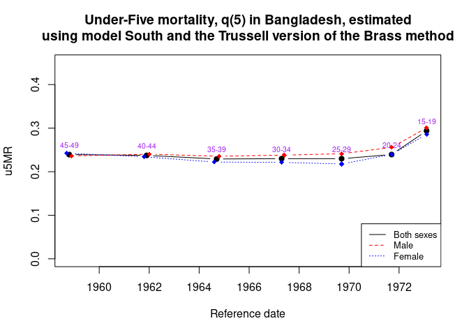
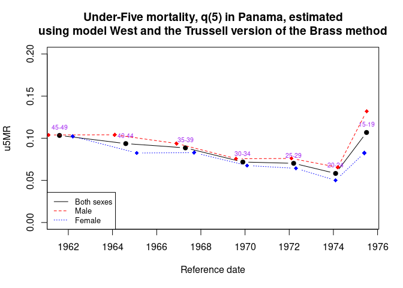

<!-- README.md is generated from README.Rmd. Please edit that file -->

# Under-Five Child Mortality Estimation using the R Package `u5mr`

<!-- badges: start -->

[](https://lifecycle.r-lib.org/articles/stages.html#stable)
<!-- badges: end -->

`u5mr` is a open-source R package for estimating the child mortality.
Current implementation includes the Trussell version of the Brass method
using the Coale-Demeny model life tables and supporting datasets of
coefficients and automatic interpolating values between probabilities of
dying at a certain age and model tables.

## Installation

To download the developmental version of the u5mr package, use the code
below.

``` r
# install.packages("devtools")
devtools::install_github("myominnoo/u5mr")
```

## Usage

The first example is using Bangladesh survey data and model South of the
Coale-Demeny life table.

``` r
library(u5mr)

## Using Bangladesh survey data to estimate child mortality
data("bangladesh")
bang_both <- u5mr_trussell(bangladesh, sex = "both", model = "south", svy_year = 1974.3)
bang_both
#>   agegrp   women child_born child_dead        pi        di        ki        qx
#> 1  15-19 3014706    1160919     215365 0.3850853 0.1855125 0.9170244 0.1701195
#> 2  20-24 2653155    4901382     997384 1.8473787 0.2034904 0.9954643 0.2025674
#> 3  25-29 2607009    9085852    1937955 3.4851633 0.2132937 0.9906944 0.2113089
#> 4  30-34 2015663    9910256    2261196 4.9166235 0.2281673 1.0075009 0.2298787
#> 5  35-39 1771680   10384001    2490168 5.8611041 0.2398081 1.0293505 0.2468466
#> 6  40-44 1479575    9164329    2415023 6.1938928 0.2635243 1.0094877 0.2660245
#> 7  45-49 1135129    6905673    1959544 6.0836020 0.2837586 0.9972749 0.2829853
#>          ti   year          h        q5
#> 1  1.179512 1973.1 0.06844071 0.2936809
#> 2  2.573340 1971.7 0.69835995 0.2393985
#> 3  4.591300 1969.7 0.25513876 0.2298161
#> 4  6.972056 1967.3 0.25803543 0.2298787
#> 5  9.601908 1964.7 0.22544741 0.2291742
#> 6 12.426746 1961.9 0.60317713 0.2373407
#> 7 15.521768 1958.8 0.68837645 0.2391827
bang_male <- u5mr_trussell(bangladesh, child_born = "male_born",
                 child_dead = "male_dead", sex = "male",
                 model = "south", svy_year = 1974.3)
bang_male
#>   agegrp   women child_born child_dead        pi        di        ki        qx
#> 1  15-19 3014706     597248     117165 0.1981115 0.1961748 0.9105728 0.1786314
#> 2  20-24 2653155    2507018     529877 0.9449195 0.2113575 0.9956980 0.2104482
#> 3  25-29 2607009    4675978    1047294 1.7936179 0.2239733 0.9923244 0.2222541
#> 4  30-34 2015663    5109487    1204582 2.5348915 0.2357540 1.0092759 0.2379408
#> 5  35-39 1771680    5435726    1333957 3.0681195 0.2454055 1.0311249 0.2530437
#> 6  40-44 1479575    4883599    1291745 3.3006769 0.2645068 1.0111377 0.2674528
#> 7  45-49 1135129    3714957    1030737 3.2727179 0.2774560 0.9987376 0.2771057
#>          ti   year          h        q5
#> 1  1.192502 1973.1 0.08877256 0.3006920
#> 2  2.579408 1971.7 0.13536167 0.2555678
#> 3  4.579127 1969.7 0.47824926 0.2412141
#> 4  6.935584 1967.4 0.32705901 0.2379408
#> 5  9.538031 1964.8 0.21974177 0.2356174
#> 6 12.341232 1962.0 0.42457992 0.2400522
#> 7 15.432413 1958.9 0.24483379 0.2361607
bang_female <- u5mr_trussell(bangladesh, child_born = "female_born",
                 child_dead = "female_dead", sex = "female",
                 model = "south", svy_year = 1974.3)
bang_female
#>   agegrp   women child_born child_dead        pi        di        ki        qx
#> 1  15-19 3014706     563671      98200 0.1869738 0.1742151 0.9238170 0.1609429
#> 2  20-24 2653155    2394364     467507 0.9024591 0.1952531 0.9952065 0.1943172
#> 3  25-29 2607009    4409874     890661 1.6915454 0.2019697 0.9889674 0.1997415
#> 4  30-34 2015663    4800769    1056614 2.3817320 0.2200927 1.0056231 0.2213302
#> 5  35-39 1771680    4948275    1156211 2.7929846 0.2336594 1.0274741 0.2400790
#> 6  40-44 1479575    4280730    1123278 2.8932160 0.2624034 1.0077431 0.2644352
#> 7  45-49 1135129    3190716     928807 2.8108840 0.2910967 0.9957282 0.2898532
#>          ti   year          h        q5
#> 1  1.165826 1973.1 0.02505353 0.2857318
#> 2  2.566995 1971.7 0.02066463 0.2394660
#> 3  4.604250 1969.7 0.01367451 0.2177052
#> 4  7.010693 1967.3 0.18157708 0.2213302
#> 5  9.669503 1964.6 0.22027538 0.2221657
#> 6 12.517197 1961.8 0.78201764 0.2342938
#> 7 15.616267 1958.7 0.15543868 0.2425051

## plotting all data points
with(bang_both,
    plot(year, q5, type = "b", pch = 19,
         ylim = c(0, .45),
         col = "black", xlab = "Reference date", ylab = "u5MR",
         main = paste0("Under-Five mortality, q(5) in Bangladesh, estimated\n",
                       "using model South and the Trussell version of the Brass method")))
with(bang_both, text(year, q5, agegrp, cex=0.65, pos=3,col="purple"))
with(bang_male, lines(year, q5, pch = 18, col = "red", type = "b", lty = 2))
with(bang_female,
    lines(year, q5, pch = 18, col = "blue", type = "b", lty = 3))
legend("bottomright", legend=c("Both sexes", "Male", "Female"),
      col = c("Black", "red", "blue"), lty = 1:3, cex=0.8)
```



Below, the second example is demonstrated using Panama survey data and
model West.

``` r
## Using panama survey data to estimate child mortality
data("panama")
pnm_both <- u5mr_trussell(panama, sex = "both", model = "west", svy_year = 1976.5)
pnm_both
#>   agegrp women child_born child_dead       pi         di        ki         qx
#> 1  15-19  2695        557         40 0.206679 0.07181329 1.0664294 0.07658380
#> 2  20-24  2095       2633        130 1.256802 0.04937334 1.0404542 0.05137070
#> 3  25-29  1828       4757        312 2.602298 0.06558756 0.9937778 0.06517946
#> 4  30-34  1605       6085        435 3.791277 0.07148726 1.0041775 0.07178590
#> 5  35-39  1362       6722        636 4.935389 0.09461470 1.0221369 0.09670918
#> 6  40-44  1128       6367        686 5.644504 0.10774305 1.0099799 0.10881831
#> 7  45-49   930       5276        689 5.673118 0.13059136 1.0021669 0.13087434
#>          ti   year          h         q5
#> 1  1.048001 1975.5 0.81948565 0.10681851
#> 2  2.364852 1974.1 0.92645560 0.05824125
#> 3  4.314966 1972.2 0.67558234 0.07022363
#> 4  6.636520 1969.9 0.77255738 0.07178590
#> 5  9.194406 1967.3 0.77689110 0.08856392
#> 6 11.924192 1964.6 0.07458829 0.09364872
#> 7 14.855814 1961.6 0.62026040 0.10329620
pnm_male <- u5mr_trussell(panama, child_born = "male_born",
                child_dead = "male_dead", sex = "male",
                model = "west", svy_year = 1976.5)
pnm_male
#>   agegrp women child_born child_dead        pi         di        ki         qx
#> 1  15-19  2695        278         24 0.1031540 0.08633094 1.1028540 0.09521042
#> 2  20-24  2095       1380         77 0.6587112 0.05579710 1.0394544 0.05799854
#> 3  25-29  1828       2395        172 1.3101751 0.07181628 0.9850075 0.07073958
#> 4  30-34  1605       3097        236 1.9295950 0.07620278 0.9938784 0.07573630
#> 5  35-39  1362       3444        348 2.5286344 0.10104530 1.0109014 0.10214683
#> 6  40-44  1128       3274        394 2.9024823 0.12034209 0.9983923 0.12014862
#> 7  45-49   930       2682        354 2.8838710 0.13199105 0.9908787 0.13078712
#>           ti   year         h         q5
#> 1  0.9648135 1975.5 0.7281892 0.13193006
#> 2  2.3270195 1974.2 0.9840888 0.06559956
#> 3  4.3919097 1972.1 0.6078929 0.07600789
#> 4  6.8621158 1969.6 0.5916396 0.07573630
#> 5  9.5808416 1966.9 0.6441241 0.09378708
#> 6 12.4282225 1964.1 0.2231215 0.10404412
#> 7 15.3637414 1961.1 0.2131179 0.10386235
pnm_female <- u5mr_trussell(panama, child_born = "female_born",
                child_dead = "female_dead", sex = "female",
                model = "west", svy_year = 1976.5)
pnm_female
#>   agegrp women child_born child_dead        pi         di       ki         qx
#> 1  15-19  2695        279         16 0.1035250 0.05734767 1.027639 0.05893272
#> 2  20-24  2095       1253         53 0.5980907 0.04229848 1.041099 0.04403690
#> 3  25-29  1828       2362        140 1.2921225 0.05927180 1.002714 0.05943267
#> 4  30-34  1605       2988        199 1.8616822 0.06659973 1.014781 0.06758414
#> 5  35-39  1362       3278        288 2.4067548 0.08785845 1.033741 0.09082286
#> 6  40-44  1128       3093        292 2.7420213 0.09440672 1.021957 0.09647958
#> 7  45-49   930       2594        335 2.7892473 0.12914418 1.013832 0.13093046
#>          ti   year          h         q5
#> 1  1.136167 1975.4 0.89036801 0.08250300
#> 2  2.407031 1974.1 0.82492745 0.05003973
#> 3  4.238697 1972.3 0.75975955 0.06427108
#> 4  6.406109 1970.1 0.97378159 0.06758414
#> 5  8.796807 1967.7 0.91344410 0.08287914
#> 6 11.404035 1965.1 0.88800323 0.08246445
#> 7 14.331051 1962.2 0.04466646 0.10226980

## plotting all data points
with(pnm_both,
    plot(year, q5, type = "b", pch = 19,
        ylim = c(0, .2), col = "black", xlab = "Reference date", ylab = "u5MR",
         main = paste0("Under-Five mortality, q(5) in Panama, estimated\n",
                       "using model West and the Trussell version of the Brass method")))
with(pnm_both, text(year, q5, agegrp, cex=0.65, pos=3,col="purple"))
with(pnm_male,
    lines(year, q5, pch = 18, col = "red", type = "b", lty = 2))
with(pnm_female,
    lines(year, q5, pch = 18, col = "blue", type = "b", lty = 3))
legend("bottomleft", legend=c("Both sexes", "Male", "Female"),
      col = c("Black", "red", "blue"), lty = 1:3, cex=0.8)
```



## Bug Reports / Change Requests

If you encounter a clear bug, please file an issue with a minimal
reproducible example on
[GitHub](https://github.com/myominnoo/u5mr/issues).

## Getting Help

For questions and other discussion, please directly email me
[dr.myominnoo@gmail.com](mailto::dr.myominnoo@gmail.com).

## Citation

To cite the u5mr package in publications use

``` 
  @Manual{Myo2020space,
    title = {Under-Five Child Mortality Estimation using the R Package u5mr},
    author = {Myo Minn Oo},
    year = {2021}
  }
```

-----

Please note that this project is looking for contributors. By
participating in this project, you agree to abide by its terms with
[Contributor Code of
Conduct](https://www.contributor-covenant.org/version/1/0/0/code-of-conduct/),
version 1.0.0, available at
<https://www.contributor-covenant.org/version/1/0/0/code-of-conduct/>.
